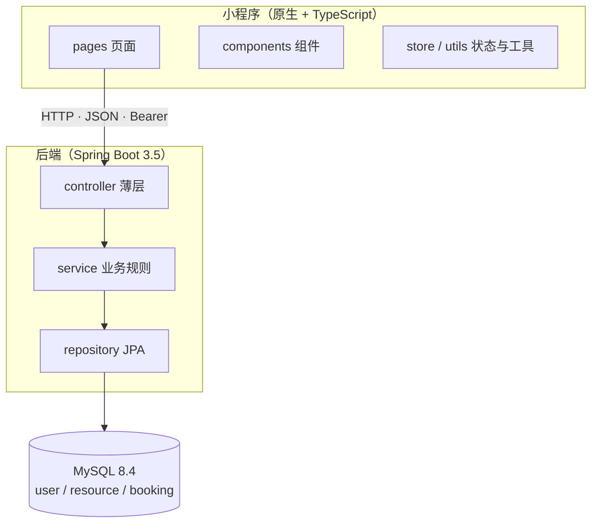

# CampusReserve

校园场地预约微信小程序 —— 模拟自习室、研讨室、摄影棚、球场等校园资源的预约场景。

项目完整走了一遍微信小程序开发流程：页面与导航、组件化、生命周期、网络请求、微信登录、
本地缓存、预约业务、真机调试、后端 API、数据库设计与 Git 版本管理。

- **小程序**：原生框架 + TypeScript + WXML + WXSS
- **后端**：Java 17 + Spring Boot 3.5.16 + Maven + JPA
- **数据库**：MySQL 8.4（`user` / `resource` / `booking` 三张表）
- **验证**：4 套自动化测试，累计 **699** 项断言（真实开发者工具 + 真实 HTTP + 真实 MySQL）

## 功能

- **资源浏览**：首页分类入口 + 热门/推荐资源，列表页分类筛选，详情页日期条 + 时间段三态
- **预约**：选日期 → 选时段 → 提交，服务端六条校验（含时段冲突并发兜底）
- **我的预约**：待使用 / 已完成 / 已取消三个页签，状态按「时段是否已过」派生
- **取消预约**：二次确认，仅本人可取消，取消后时段自动恢复可用
- **微信登录**：`wx.login` → `code2session` 换 openid（未配置密钥时自动降级本地映射）
- **体验**：统一反馈层、下拉刷新、空态/错误态、筛选条件缓存、安全区适配

## 技术栈

| 层 | 选型 |
| --- | --- |
| 小程序 | 微信小程序原生框架 + TypeScript + WXML + WXSS |
| 后端 | Java 17 + Spring Boot 3.5.16 + Maven |
| 数据库 | MySQL 8.4 |
| 接口 | REST API，统一 JSON 响应（`{ code, message, data }`） |

## 架构

小程序经 HTTP 访问后端；后端严格三层（Controller → Service → Repository）；
「同一资源同一日期同一起始时刻只能一条有效预约」由数据库生成列 + 唯一索引兜底。



> 完整架构图、页面流程图、数据库 ER 图见 [`docs/diagrams/`](./docs/diagrams/)，
> 或在 GitHub 上直接查看这三个文件（均为 Mermaid，可渲染）。

## 快速开始

三步，缺一不可：

**1. 起后端**（需要 MySQL 已运行）

```powershell
cd E:\path\to\CampusReserve\backend
$env:CR_DB_PASSWORD = '你的数据库口令'
java -jar target\campusreserve-backend-0.1.0.jar
```

看到 `Tomcat started on port 8088` 即可。首次启动会自动建库、建表并写入 8 条种子资源。

**2. 打开小程序**

微信开发者工具 → 导入项目 → 目录选仓库下的 `CampusReserve/` 子目录（**不是仓库根**）
→ 「详情 → 本地设置」勾选 **不校验合法域名** → 编译。

**3. 确认数据来源开关**

`CampusReserve/services/config.ts` 中的 `USE_MOCK_DATA` 决定数据从哪来：

| 取值 | 数据来源 | 需要后端吗 |
| --- | --- | --- |
| `false`（**当前正式状态**） | 真实 HTTP 请求 → `http://127.0.0.1:8088/api` | 需要 |
| `true` | `services/mock-*.ts` 本地数据（含登录、预约、取消全流程） | 不需要 |

改成 `true` 后仅编译即可跑通全部交互，适合只想看页面、不想起后端时使用；
但它只是开发期机制，**不是交付状态**——正式状态是 `false`。

> **端口为什么是 8088 而不是 8080**：本机 8080 已被 Docker 里其他项目的容器占用。
> 沿用 8080 会导致后端启动端口冲突，或小程序请求被别的后端接走（页面出现本项目
> 仓库里根本不存在的文案，如「未认证或 Token 失效」）。后端端口与
> `services/config.ts` 的 `API_BASE_URL` 必须一致，改一处就要改另一处。

## 运行后端

### 方式一：直接运行已构建的 jar（最快）

```powershell
cd backend
$env:CR_DB_PASSWORD = '***'
java -jar target\campusreserve-backend-0.1.0.jar
```

### 方式二：从源码运行（改后端代码时用）

```powershell
cd backend
$env:CR_DB_PASSWORD = '***'
.\mvnw.cmd spring-boot:run          # Windows
./mvnw spring-boot:run              # macOS / Linux
```

工程自带 Maven Wrapper，**无需本机安装 Maven**。

### 环境变量

公开仓库不写死任何凭据，连接信息与密钥一律环境变量注入：

| 变量 | 必填 | 作用 |
| --- | --- | --- |
| `CR_DB_PASSWORD` | **是** | 数据库口令，缺了启动即 `Access denied ... (using password: NO)` |
| `CR_TOKEN_SECRET` | 否 | 登录令牌的 HMAC 签名密钥。缺省每次启动随机生成，**重启会让既有登录态失效**，长期联调建议固定 |
| `CR_WECHAT_APPID` | 否 | 微信 AppID，与下一项同时配置才走真实 `code2session` |
| `CR_WECHAT_SECRET` | 否 | 微信 AppSecret，缺省自动降级为本地用户映射 |
| `CR_SERVER_PORT` | 否 | 覆盖默认端口 8088 |
| `CR_DB_URL` / `CR_DB_USERNAME` | 否 | 覆盖默认数据源（默认 `127.0.0.1:3308/campusreserve`，用户 `root`） |

### 启动自检

```powershell
Invoke-WebRequest -NoProxy 'http://127.0.0.1:8088/api/health' -UseBasicParsing | Select-Object -ExpandProperty Content
# {"code":0,"message":"success","data":{"status":"UP","service":"campusreserve-backend"}}
```

响应中只有 `code` / `message` / `data` 三个字段。若出现 `timestamp` 字段或与本项目
无关的错误文案，说明请求被**别的后端**接走了，检查端口占用。

## 运行小程序

1. 打开微信开发者工具 → 导入项目
2. 目录选择本仓库的 `CampusReserve/` 子目录（**不是仓库根目录**，
   否则报 `app.json: 在项目根目录未找到 app.json`）
3. AppID 使用 `project.config.json` 中已配置的 AppID
4. 「详情 → 本地设置」勾选 **不校验合法域名、web-view、TLS 版本以及 HTTPS 证书**
   ——本地是 `http://127.0.0.1`，不勾选会被微信拦截
5. 编译

**真机预览**多一步：手机上的 `127.0.0.1` 指向手机自身，需把 `services/config.ts` 的
`API_BASE_URL` 改为电脑的局域网 IP（如 `http://192.168.1.10:8088/api`），
并保证手机与电脑在同一局域网。

## 设计要点

几个值得单独说明的实现取舍，完整理由见 [`docs/PROJECT_MEMORY.md`](./docs/PROJECT_MEMORY.md) §11。

**预约并发一致性交给数据库，而不是应用层判断。**
`booking.active_slot_key` 是一个 STORED 生成列：有效预约求值为
`resource_id|booking_date|HH:mm`，取消后为 `NULL`。它上面建了唯一索引，
而 MySQL 唯一索引不约束 `NULL` —— 于是「同一资源同一日期同一起始时刻只能有一条有效预约」
和「取消后该时段可再约」同时成为**物理约束**，不需要任何清理动作。
Service 层的事先查询只负责给出「该时段已被预约」这句友好文案。
8 条并发抢同一时段的实测结果：7 条被唯一索引拦下并翻译为 `409001`，恰好 1 条成功。

**可用时间段是合成出来的，不入库。**
`resource.open_slots` 提供骨架，booking 表叠加 `BOOKED`，当前时间之前的格子标 `DISABLED`。
因此「某天某时段能否预约」只有一处真源，不存在两份数据不同步的问题。

**微信登录是双模式 + 自动降级，同一份代码两条路径。**
配置了 `CR_WECHAT_APPID` / `CR_WECHAT_SECRET` 就走真实的 `jscode2session`，
否则由 code 派生本地用户映射。换环境不需要翻任何开关，
也就不会出现「上生产忘了切回来」这类事故。

**登录令牌是 HMAC 自包含令牌，不引入 Redis 或会话表。**
为了守住「只有三张核心表」的约束，令牌设计为三段式签名串，用户身份从令牌自身解析。
代价是**无法主动失效**（只能等过期），这是有意的取舍而非疏漏。

**业务失败一律 HTTP 200，只有未登录/登录态失效用 401。**
前端 `request.ts` 因此只需一条判断路径，不必为每个接口记「哪种错是 4xx」；
401 单独出来是因为它触发的动作（清本地登录态 + 引导重新登录）与其他失败完全不同。

**「已完成」是前端派生状态，服务端不写回。**
服务端的 `status` 只记录显式变更（创建 `PENDING`、取消 `CANCELLED`），
「场次已经结束了」没有任何人去点一下，却已经变了。前端用纯函数按当前时刻派生展示状态，
**只派生、不写回** —— 让 `GET` 产生写副作用是不干净的。

**页面不感知数据从哪来。**
`services/resource.ts` / `booking.ts` / `auth.ts` 内部各有一处 `USE_MOCK_DATA` 分支，
切换数据源不需要改动任何页面或组件代码，这也是开发期数据源能在后端就绪前
先跑通全部页面交互的原因。

## 目录结构

```text
CampusReserve/                # 仓库根
├── CampusReserve/            # 微信小程序工程（用开发者工具打开的是本目录）
│   ├── pages/                # 页面
│   ├── components/           # 可复用 UI 组件
│   ├── services/             # API 请求封装
│   ├── utils/                # 工具函数
│   ├── types/                # TypeScript 类型
│   ├── store/                # 必要的全局状态
│   ├── typings/              # 微信小程序 API 类型定义
│   ├── app.ts / app.json / app.wxss
│   └── project.config.json
├── backend/                  # Spring Boot 后端
│   ├── src/main/java/com/campusreserve/
│   │   ├── controller/       # 只处理 HTTP 与参数
│   │   ├── service/          # 业务规则
│   │   ├── repository/       # 数据库访问
│   │   ├── security/         # 鉴权（HMAC 令牌 + 拦截器）
│   │   ├── dto/ entity/ common/ config/
│   └── src/main/resources/
│       ├── application.yml
│       └── db/               # 幂等建表 + 种子数据
├── docs/                     # 全部项目文档
│   └── diagrams/             # 架构图 / 页面流程图 / ER 图（Mermaid）
└── tools/                    # 测试脚本
    ├── e2e/                  # 端到端测试（真实开发者工具）
    └── api-test/             # 后端接口实测（直接打 HTTP）
```

## API 一览

统一响应 `{ code, message, data }`，业务失败用 HTTP 200 承载、未登录/失效用 HTTP 401。

| 接口 | 说明 | 鉴权 |
| --- | --- | --- |
| `GET /api/health` | 连通性自检 | 否 |
| `POST /api/auth/login` | 微信登录，code 换登录态 | 否 |
| `GET /api/resources` | 资源列表（`type` / `limit` 可选） | 否 |
| `GET /api/resources/{id}` | 资源详情（不存在返回 `data:null`） | 否 |
| `GET /api/resources/{id}/availability` | 指定日期可用时段 | 否 |
| `POST /api/bookings` | 创建预约 | 是 |
| `GET /api/bookings/my` | 我的预约（预约详情复用它） | 是 |
| `DELETE /api/bookings/{id}` | 取消预约 | 是 |

错误码统一「HTTP 状态码 × 1000」：`400001` 参数错误 / `400002` 非法时间 /
`401001` 未登录 / `401002` 登录失败 / `404001` 不存在 / `409001` 时段冲突 / `500000` 服务端异常。

完整契约见 [`docs/05_api_contract.md`](./docs/05_api_contract.md)，数据库设计见
[`docs/03_database_design.md`](./docs/03_database_design.md)。

## 测试

四套测试职责互不替代，合计 **699** 项断言：

| 脚本 | 验证什么 | 数据来源 | 规模 |
| --- | --- | --- | --- |
| `tools/e2e/e2e-phase1..9.js` | 页面与交互（含各失败分支） | 本地数据源（`USE_MOCK_DATA=true`） | 559 项 |
| `tools/e2e/e2e-phase11.js` | 切真实后端后全链路 + 失败分支 | 真实后端 + MySQL | 36 项 |
| `tools/e2e/e2e-real-backend.js` | 小程序 ↔ 真实后端核心读写链路 | 真实后端 + MySQL | 28 项 |
| `tools/api-test/api-phase10.js` | 后端接口本身（不经过小程序，含并发） | 真实后端 + MySQL | 76 项 |

端到端测试在**真实微信开发者工具**中运行（`miniprogram-automator` 驱动），
不是模拟 DOM。运行方式、前置条件与 40 条踩坑清单见
[`tools/e2e/README.md`](./tools/e2e/README.md)。

跑真实后端那三套前需要：后端已启动 → `USE_MOCK_DATA = false` →
开发者工具已勾选「不校验合法域名」→ 已开启服务端口并启动自动化模式。

## 数据库

- 本机使用 MySQL 8.4 实例：`127.0.0.1:3308`，服务名 `MySQL84`
- 项目库：`campusreserve`（三张表：`user` / `resource` / `booking`）
- 建表与种子数据走 `spring.sql.init`（`db/schema.sql` + `db/data.sql`），
  全部幂等（`IF NOT EXISTS` / `INSERT IGNORE`），可反复启动
- **数据库口令不写入仓库**：本仓库为公开仓库，连接信息一律通过环境变量注入

## 开发阶段

按 [`docs/04_development_plan.md`](./docs/04_development_plan.md) 的 13 个阶段推进：

| 阶段 | 内容 | 状态 |
| --- | --- | --- |
| Phase 0 ~ 9 | 项目准备 → 小程序功能与体验优化 | 已完成 |
| Phase 10 | 后端与数据层整理 | 已完成 |
| Phase 11 | 测试（切真实后端 + 完整回归） | 已完成 |
| Phase 12 | 作品集整理 | 进行中（README / 架构图 / 页面流程图 / ER 图 / API 说明已完成，项目截图与真机演示视频待补） |

当前进度、已知问题与关键决策见 [`docs/PROJECT_MEMORY.md`](./docs/PROJECT_MEMORY.md)。
E2E 相关的 40 条环境陷阱集中在 [`tools/e2e/README.md`](./tools/e2e/README.md)。

## 文档

全部项目文档统一放在 `docs/` 下：

| 文档 | 说明 |
| --- | --- |
| [`docs/01_requirements.md`](./docs/01_requirements.md) | 需求规格说明书 |
| [`docs/02_technical_design.md`](./docs/02_technical_design.md) | 技术选型、工程规范与开发约束 |
| [`docs/03_database_design.md`](./docs/03_database_design.md) | 数据库设计 |
| [`docs/04_development_plan.md`](./docs/04_development_plan.md) | 开发阶段计划 |
| [`docs/05_api_contract.md`](./docs/05_api_contract.md) | API 契约 |
| [`docs/diagrams/`](./docs/diagrams/) | 架构图 / 页面流程图 / ER 图 |
| [`docs/AGENTS.md`](./docs/AGENTS.md) | AI 协同开发规范 |
| [`docs/PROJECT_MEMORY.md`](./docs/PROJECT_MEMORY.md) | 项目当前状态 |

## 提交规范

Commit Message 使用**中文 Conventional Commits**：

```text
<type>(<scope>): <中文简述>
```

- type：`feat` `fix` `docs` `refactor` `perf` `test` `build` `chore` `revert`
- scope（可选）：`miniprogram` `backend` `docs` `db` `api`
- 简述：中文动宾结构，不加句号，不超过 50 字

```text
feat(miniprogram): 新增资源列表页与分类筛选
fix(backend): 修复同一时段重复预约未被拦截
docs: 统一文档目录并修正编号
```

提交信息与仓库文件中不得出现真实密码、密钥、令牌。
