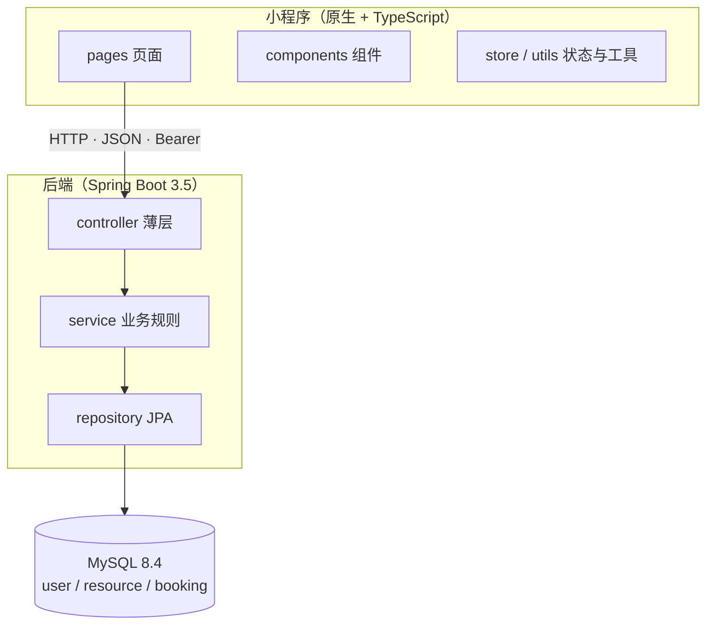

# CampusReserve

校园场地预约微信小程序 —— 模拟自习室、研讨室、摄影棚、球场等校园资源的预约场景。

项目完整走了一遍微信小程序开发流程：页面与导航、组件化、生命周期、网络请求、微信登录、
本地缓存、预约业务、真机调试、后端 API、数据库设计与 Git 版本管理。

## 功能

- **资源浏览**：首页分类入口 + 热门/推荐资源，列表页分类筛选，详情页日期条 + 时间段三态
- **预约**：选日期 → 选时段 → 提交，服务端六条校验（含时段冲突并发兜底）
- **我的预约**：待使用 / 已完成 / 已取消三个页签，状态按「时段是否已过」派生
- **取消预约**：二次确认，仅本人可取消，取消后时段自动恢复可用
- **微信登录**：`wx.login` → `code2session` 换 openid（未配置密钥时自动降级本地映射）
- **体验**：统一反馈层、下拉刷新、空态/错误态、筛选条件缓存、安全区适配

## 技术栈

| 层 | 选型 |
| --- | --- |
| 小程序 | 微信小程序原生框架 + TypeScript + WXML + WXSS |
| 后端 | Java 17 + Spring Boot 3.5.16 + Maven |
| 数据库 | MySQL 8.4 |
| 接口 | REST API，统一 JSON 响应（`{ code, message, data }`） |

## 架构

小程序经 HTTP 访问后端；后端严格三层（Controller → Service → Repository）；
「同一资源同一日期同一起始时刻只能一条有效预约」由数据库生成列 + 唯一索引兜底。



> 完整架构图、页面流程图、数据库 ER 图见 [`docs/diagrams/`](./docs/diagrams/)，
> 或在 GitHub 上直接查看这三个文件（均为 Mermaid，可渲染）。

## 目录结构

```text
CampusReserve/                # 仓库根
├── CampusReserve/            # 微信小程序工程（用开发者工具打开的是本目录）
│   ├── pages/                # 页面
│   ├── components/           # 可复用 UI 组件
│   ├── services/             # API 请求封装
│   ├── utils/                # 工具函数
│   ├── types/                # TypeScript 类型
│   ├── store/                # 必要的全局状态
│   ├── typings/              # 微信小程序 API 类型定义
│   ├── app.ts / app.json / app.wxss
│   └── project.config.json
├── backend/                  # Spring Boot 后端
│   ├── src/main/java/com/campusreserve/
│   │   ├── controller/       # 只处理 HTTP 与参数
│   │   ├── service/          # 业务规则
│   │   ├── repository/       # 数据库访问
│   │   ├── security/         # 鉴权（HMAC 令牌 + 拦截器）
│   │   ├── dto/ entity/ common/ config/
│   └── src/main/resources/
│       ├── application.yml
│       └── db/               # 幂等建表 + 种子数据
├── docs/                     # 全部项目文档
│   └── diagrams/             # 架构图 / 页面流程图 / ER 图（Mermaid）
└── tools/                    # 测试脚本
    ├── e2e/                  # 端到端测试（真实开发者工具）
    └── api-test/             # 后端接口实测（直接打 HTTP）
```

## API 一览

统一响应 `{ code, message, data }`，业务失败用 HTTP 200 承载、未登录/失效用 HTTP 401。

| 接口 | 说明 | 鉴权 |
| --- | --- | --- |
| `GET /api/health` | 连通性自检 | 否 |
| `POST /api/auth/login` | 微信登录，code 换登录态 | 否 |
| `GET /api/resources` | 资源列表（`type` / `limit` 可选） | 否 |
| `GET /api/resources/{id}` | 资源详情（不存在返回 `data:null`） | 否 |
| `GET /api/resources/{id}/availability` | 指定日期可用时段 | 否 |
| `POST /api/bookings` | 创建预约 | 是 |
| `GET /api/bookings/my` | 我的预约（预约详情复用它） | 是 |
| `DELETE /api/bookings/{id}` | 取消预约 | 是 |

完整契约见 [`docs/05_api_contract.md`](./docs/05_api_contract.md)，数据库设计见
[`docs/03_database_design.md`](./docs/03_database_design.md)。

## 环境要求

- 微信开发者工具（稳定版）
- Node.js 18+（仅用于依赖与工具链，小程序业务代码不依赖 Node）
- JDK 17
- Maven 3.9+（工程自带 `mvnw`，无需单独安装）
- MySQL 8.x

## 运行小程序

1. 打开微信开发者工具 → 导入项目
2. 目录选择本仓库的 `CampusReserve/` 子目录（不是仓库根目录）
3. AppID 使用 `project.config.json` 中已配置的 AppID
4. 编译即可启动

本地联调后端时，在「详情 → 本地设置」勾选 **不校验合法域名**；
真机预览时需把 `services/config.ts` 中的 `API_BASE_URL` 改为电脑的局域网 IP。

## 运行后端

```bash
cd backend
./mvnw spring-boot:run
```

后端需要数据库口令与（可选）微信凭据，均通过环境变量注入（公开仓库不写死密钥）：

```bash
# PowerShell 示例
$env:CR_DB_PASSWORD = '***'          # 必填，否则启动即 Access denied
$env:CR_WECHAT_APPID = 'wx...'       # 可选，配了走真实 code2session
$env:CR_WECHAT_SECRET = '***'        # 可选，同上；缺省自动降级本地映射
$env:CR_TOKEN_SECRET = '***'         # 可选，HMAC 签名密钥（缺省随机生成）
./mvnw spring-boot:run
```

启动后验证：

```bash
curl http://localhost:8088/api/health
# {"code":0,"message":"success","data":{"status":"UP","service":"campusreserve-backend"}}
```

数据库在首次启动时自动创建（`createDatabaseIfNotExist=true`），并执行幂等建表 + 8 条种子资源。

## 测试

三层验证，职责互不替代：

| 脚本 | 验证什么 | 规模 |
| --- | --- | --- |
| `tools/e2e/e2e-phase1..9.js` | 页面与交互（含各失败分支，开发期数据源） | 合计 559 项 |
| `tools/e2e/e2e-phase11.js` | 切真实后端后的完整回归（`USE_MOCK_DATA=false`） | 36 项 |
| `tools/e2e/e2e-real-backend.js` | 小程序 ↔ 真实后端联通冒烟 | 28 项 |
| `tools/api-test/api-phase10.js` | 后端接口本身（直接打 HTTP，含并发） | 76 项 |

端到端测试在**真实微信开发者工具**中运行（`miniprogram-automator`），运行方式与踩坑清单见
[`tools/e2e/README.md`](./tools/e2e/README.md)。

## 数据库

- 本机使用 MySQL 8.4 实例：`127.0.0.1:3308`，服务名 `MySQL84`
- 项目库：`campusreserve`（三张表：`user` / `resource` / `booking`）
- **数据库口令不写入仓库**：本仓库为公开仓库，连接信息一律通过环境变量注入。

## 开发阶段

按 [`docs/04_development_plan.md`](./docs/04_development_plan.md) 的 13 个阶段推进，
Phase 0 ~ Phase 11 已完成，当前进度与已知问题见
[`docs/PROJECT_MEMORY.md`](./docs/PROJECT_MEMORY.md)。

## 文档

全部项目文档统一放在 `docs/` 下：

| 文档 | 说明 |
| --- | --- |
| [`docs/01_requirements.md`](./docs/01_requirements.md) | 需求规格说明书 |
| [`docs/02_technical_design.md`](./docs/02_technical_design.md) | 技术选型、工程规范与开发约束 |
| [`docs/03_database_design.md`](./docs/03_database_design.md) | 数据库设计 |
| [`docs/04_development_plan.md`](./docs/04_development_plan.md) | 开发阶段计划 |
| [`docs/05_api_contract.md`](./docs/05_api_contract.md) | API 契约 |
| [`docs/diagrams/`](./docs/diagrams/) | 架构图 / 页面流程图 / ER 图 |
| [`docs/AGENTS.md`](./docs/AGENTS.md) | AI 协同开发规范 |
| [`docs/PROJECT_MEMORY.md`](./docs/PROJECT_MEMORY.md) | 项目当前状态 |

## 提交规范

Commit Message 使用**中文 Conventional Commits**：

```text
<type>(<scope>): <中文简述>
```

- type：`feat` `fix` `docs` `refactor` `perf` `test` `build` `chore` `revert`
- scope（可选）：`miniprogram` `backend` `docs` `db` `api`
- 简述：中文动宾结构，不加句号，不超过 50 字

```text
feat(miniprogram): 新增资源列表页与分类筛选
fix(backend): 修复同一时段重复预约未被拦截
docs: 统一文档目录并修正编号
```

提交信息与仓库文件中不得出现真实密码、密钥、令牌。
