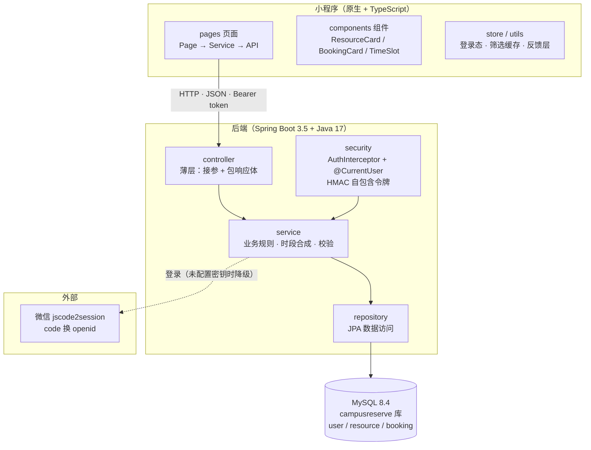

# 系统架构图

> 小程序经 HTTP 访问后端；后端严格三层（Controller → Service → Repository）；
> 一致性约束落在数据库。登录 token 为 HMAC 自包含令牌，不引 Redis / 会话表。

三层职责一句话：Controller 只处理 HTTP 与参数，Service 承载业务规则（含可用时段的三步合成、
六条预约校验顺序），Repository 管数据库访问；「同一资源同一日期同一起始时刻只能一条有效预约」
由 `booking.active_slot_key` 生成列 + 唯一索引在数据库层兜底。
