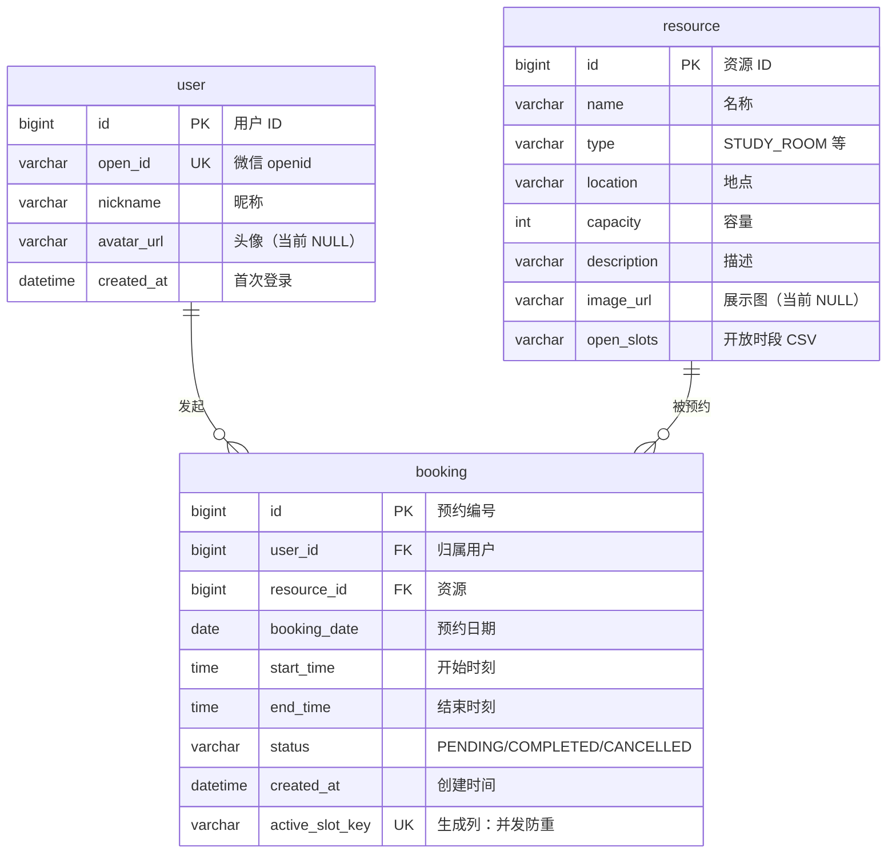

# 数据库 ER 图

> 三张表：`user`（一个微信 openid 对应一行）、`resource`（静态资源与时段配置）、
> `booking`（预约记录，唯一被并发写入的表）。核心约束在 `booking.active_slot_key`。

`active_slot_key` 是 **STORED 生成列 + 唯一索引**：有效预约得到
`"resourceId|date|HH:mm"` 的键（物理不可重复）；取消时求值为 `NULL`
（MySQL 唯一索引允许多个 NULL），因此「取消后可再约同一时段」无需任何清理动作。
