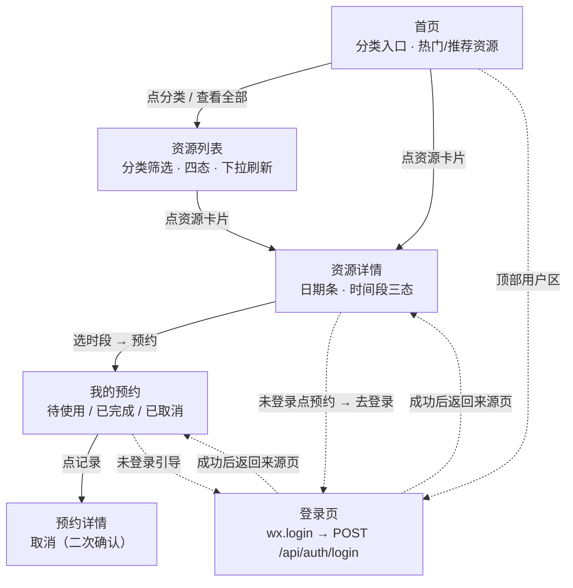

# 页面流程图

> 核心业务闭环：登录 → 首页 → 列表 → 详情 → 选日期 → 选时段 → 预约 → 我的预约 → 详情 → 取消。
> 未登录访问预约流程时会被引导到登录页，登录成功后返回来源页（已选时段保留）。

三处登录入口：首页顶部用户区、资源详情点预约时的未登录引导、我的预约页的未登录引导。
登录成功后自动返回来源页，详情页已选时段保留（`navigateBack` 复用原页面实例）。
